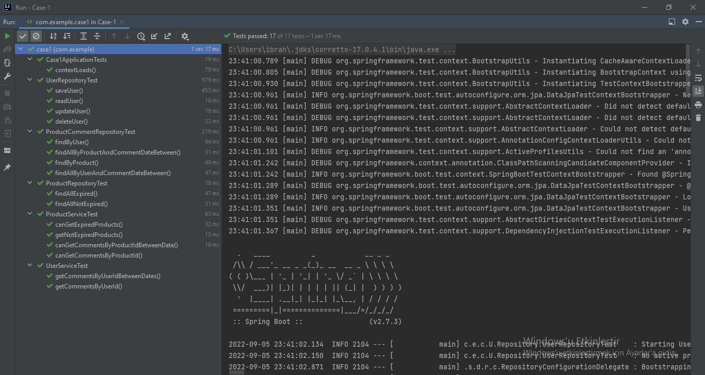

# Case-1
In this case Entities and according Repositories in the table below created.

| Kullanıcı        | Urun                               | UrunYorum         |
|------------------|------------------------------------|-------------------|
| Id               | Id                                 | Id                |
| Adı(50 char)     | Adı                                | Yorum(500 char)   |
| Soyadı(50 char)  | Fiyat                              | yorumTarihi(date) |
| Email(50 char)   | Son Kullanma Tarihi(null olabilir) | urunId            |
| telefon(15 char) |                                    | kullaniciId       |

These repositories should contain methods that implement functionalities such as
- Write a method that lists comments on a specific product.
- Write a method that lists comments on a specific product between given dates.
- Write a method that lists all comments that commented by a specific user.
- Write a method that lists all comments that commented by a specific user between given dates.
- Write a method that lists expired products.
- Write a method that lists not expired products (Also lists products that expiration date is NULL).

Turkish version of list above

- Bir ürüne ait yorumları listeleyen bir metot yazınız.
- Verilen tarih aralıklarında belirli bir ürüne yapılmış olan yorumları gösteren bir metot yazınız.
- Bir kullanıcının yapmış olduğu yorumları listeleyen bir metot yazınız.
- Bir kullanıcının belirli tarihler aralığında yapmış olduğu yorumları gösteren bir metot yazınız.
- Son kullanma tarihi geçmiş ürünleri listeleyen bir metot yazınız.
- Son kullanma tarihi geçmemiş ürünleri listeleyen bir metot yazınız. (Son kullanma tarihi boş olanlar da gelmeli.)

To implement those functionalities an API implemented with Postgresql database and prefilled
with [data.sql](./src/main/resources/data.sql)

[Mockaroo](https://www.mockaroo.com/) used to create mock data.

---

## API Endpoints

| Endpoint              | Functionality                                                                                                                                       | Request Type |
|-----------------------|-----------------------------------------------------------------------------------------------------------------------------------------------------|--------------|
| /products/id/comments | lists comments on a specific product. If start_date and end_date Request Parameters get value returns comments between those dates.                 | GET          |
| /products/expired     | lists expired products.                                                                                                                             | GET          |
| /products/notexpired  | lists not expired products                                                                                                                          | GET          |
| /users/id/comments    | lists all comments that commented by a specific user. If start_date and end_date Request Parameters get value returns comments between those dates. | GET          |

---

## Tests
Repository and Services tested to verify functionality of the project.
H2 in-memory database used for testing.
Test results can be seen in the image below.

